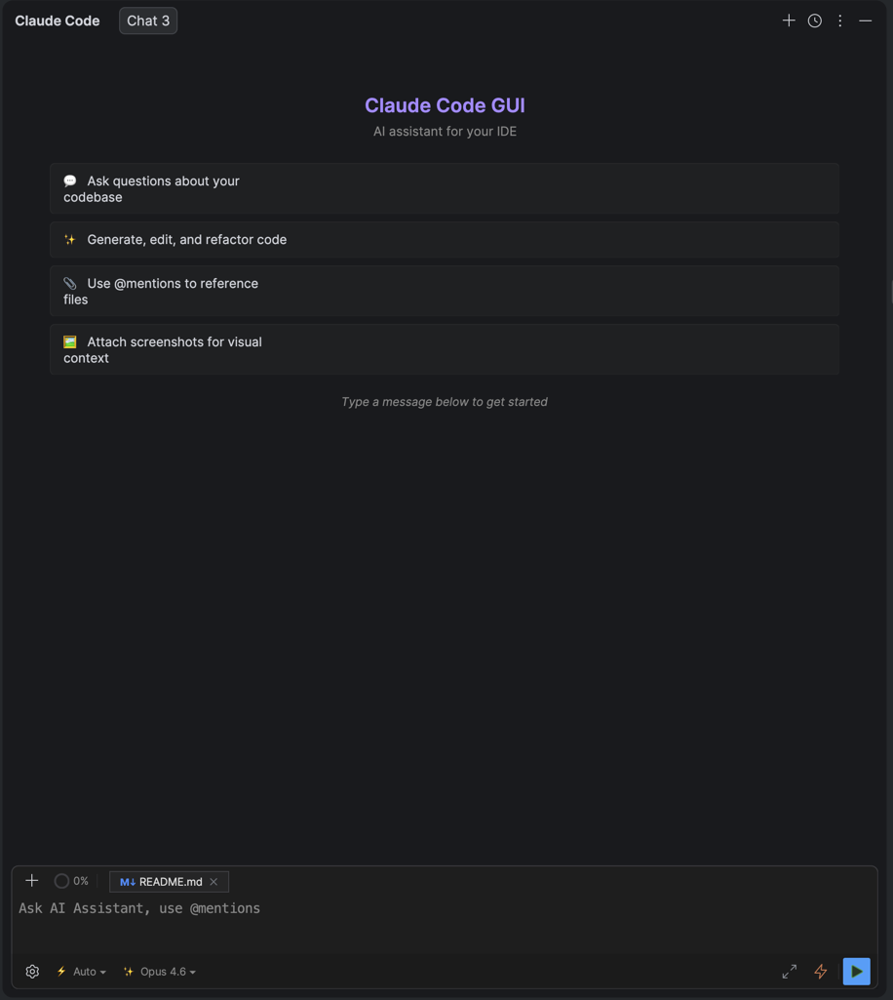

<p align="center">
  
</p>

<h1 align="center">Ultimate Claude UI</h1>

<p align="center">
  <strong>The fastest, most lightweight Claude Code integration for IntelliJ IDEA</strong>
</p>

<p align="center">
  Pure Kotlin/Swing &mdash; zero webviews, zero lag, zero compromise.
</p>

<p align="center">
  <a href="#installation">Installation</a> &bull;
  <a href="#features">Features</a> &bull;
  <a href="#architecture">Architecture</a> &bull;
  <a href="#building-from-source">Build</a>
</p>

<p align="center">
  <b>🇬🇧 English</b> | <a href="README.ru.md">🇷🇺 Русский</a>
</p>

---

## Why Ultimate Claude UI?

Most AI plugins for IDEs rely on embedded browsers (JCEF/Chromium), Electron wrappers, or webviews. That means **extra memory, slow startup, and micro-lags** on every interaction.

**Ultimate Claude UI takes a different approach.** It's built entirely in **native Kotlin/Swing** &mdash; the same toolkit IntelliJ itself uses. The result:

- **Instant startup** &mdash; no browser engine to bootstrap
- **Near-zero memory overhead** &mdash; no hidden Chromium process eating your RAM
- **Buttery-smooth scrolling** &mdash; hardware-accelerated rendering with proper `RenderingHints`
- **Feels like a built-in IDE feature**, not a bolt-on

> *No JCEF. No React. No webviews. Just fast, native UI that respects your IDE.*

---

## Screenshots



---

## Features

### Chat & Conversations

- **Multi-tab chat** &mdash; run several conversations in parallel, rename and close tabs freely
- **Streaming responses** with real-time elapsed timer
- **Extended thinking** &mdash; collapsible panel to inspect Claude's chain-of-thought reasoning
- **Session history** &mdash; browse, search, and resume past conversations
- **Markdown rendering** &mdash; full CommonMark + GFM (tables, strikethrough, autolinks)
- **Welcome screen** with quick-start tips for new users

### Code & Files

- **`@mentions`** &mdash; reference any project file directly in your prompt
- **Image attachments** &mdash; paste screenshots (`Ctrl+V`) or drag images for visual context
- **Inline diff viewer** &mdash; review proposed changes side-by-side before approving
- **Syntax-highlighted code blocks** with language auto-detection
- **"Send to Claude" action** (`Ctrl+Alt+K`) &mdash; select code in the editor, send it to chat instantly

### Models

| Model | ID | Best for |
|---|---|---|
| **Sonnet 4.6** | `claude-sonnet-4-6` | Default &mdash; fast & capable |
| **Opus 4.6** | `claude-opus-4-6` | Newest & most powerful |
| **Opus 4.6 1M** | `claude-opus-4-6` | Extended conversations |
| **Haiku 4.5** | `claude-haiku-4-5` | Quick answers, lowest latency |

Switch models on-the-fly from the input toolbar.

### Permission Modes

| Mode | Description |
|---|---|
| **Default** | Manual confirmation for every operation (safest) |
| **Plan** | Read-only tools; generates an implementation plan for your approval |
| **Agent** | Auto-accepts file create/edit to reduce friction |
| **Auto** | Fully automatic &mdash; bypasses all permission checks |

### Tool Use Visualization

Every tool invocation is rendered as an **expandable card** with status indicators:

- **Read** / **Edit** / **Write** &mdash; file operations with path and line-count badges
- **Bash** &mdash; command preview and output
- **Search** / **Glob** &mdash; search patterns and matched files
- **Web Fetch** / **Web Search** &mdash; URL and query display
- **Grouped tools** &mdash; multiple reads or edits collapse into a single expandable group

Approval actions (Allow / Always Allow / Deny) are **inline** &mdash; no modal popup interruptions.

### Slash Commands

Type `/` in the input field for smart autocomplete:

- **Local**: `/clear`, `/new`, `/reset`, `/help`
- **SDK**: Full set of Claude Code commands loaded from the SDK at startup
- Keyboard navigation with `Up`/`Down` arrows, `Enter` to select, `Esc` to dismiss

### Prompt Enhancer

Hit `Cmd+/` (macOS) or `Ctrl+/` to **enhance your prompt** before sending. Claude Haiku rewrites your input for clarity and detail, and you choose between the original and enhanced version.

### VCS Integration

- **"Generate Commit Message with Claude"** action in the commit dialog
- Analyzes your staged changes and produces a meaningful commit message

### Theme Customization

Three built-in presets (**Default**, **Dark+**, **Warm**) plus **30+ individually adjustable colors**:

- User message bubbles, accent colors, text, surfaces, borders
- Status colors (success / warning / error)
- Code block styling, diff highlighting
- Action buttons (approve / deny)

All changes apply in **real-time** with live preview. Separate palettes for light and dark IDE themes.

### Internationalization

Full **English** and **Russian** translations. Follows IDE language by default, or override manually in settings.

---

## Architecture

```
┌─────────────────────────────────────────────────┐
│                  IntelliJ IDEA                  │
│  ┌───────────────────────────────────────────┐  │
│  │          Ultimate Claude UI (Swing)       │  │
│  │  ChatPanel · MessageList · ToolBlocks     │  │
│  │  ApprovalPanels · DiffViewer · Themes     │  │
│  └──────────────────┬────────────────────────┘  │
│                     │ stdin/stdout               │
│  ┌──────────────────▼────────────────────────┐  │
│  │        claude-bridge.mjs (Node.js)        │  │
│  │     wraps @anthropic-ai/claude-code SDK   │  │
│  └──────────────────┬────────────────────────┘  │
│                     │                            │
│  ┌──────────────────▼────────────────────────┐  │
│  │          Claude Code SDK / API            │  │
│  └───────────────────────────────────────────┘  │
└─────────────────────────────────────────────────┘
```

**Communication protocol:** Line-based JSON over stdin/stdout with tagged messages (`[CONTENT_DELTA]`, `[TOOL_USE]`, `[PERMISSION_REQUEST]`, etc.), parsed by `SDKMessageParser` into a typed `Flow<StreamEvent>`.

**Key design decisions:**

- **Kotlin sealed classes** for all algebraic types (`ContentBlock`, `StreamEvent`)
- **Coroutines + Flow** everywhere &mdash; no callbacks, no `CompletableFuture`
- **DynamicBundle** i18n with language override support
- **Auto-detection** of Node.js and Claude CLI (Homebrew, nvm, fnm, volta, manual PATH)

---

## Installation

### From JetBrains Marketplace

> *Coming soon*

### From Source

```bash
git clone https://github.com/anthropics/ultimate-claude-ui.git
cd ultimate-claude-ui
./gradlew buildPlugin
```

The plugin ZIP will be in `build/distributions/`. Install it via **Settings > Plugins > Gear icon > Install Plugin from Disk**.

### Prerequisites

- **IntelliJ IDEA** 2025.2.4+
- **Node.js** 18+ (auto-detected or configured in settings)
- **Claude CLI** (`claude login` must be run at least once)

---

## Building from Source

```bash
./gradlew runIde          # Launch sandbox IDE with the plugin
./gradlew build           # Full build (compile + package)
./gradlew buildPlugin     # Build distribution ZIP
./gradlew test            # Run tests
```

---

## Project Structure

```
src/main/kotlin/ru/dsudomoin/claudecodegui/
├── ui/
│   ├── chat/            # Messages, bubbles, tool blocks, thinking panel
│   ├── input/           # Chat input, slash commands, model selector
│   ├── approval/        # Inline permission panels
│   ├── dialog/          # Modals (enhancer, question, plan, diff)
│   ├── status/          # Todos, file changes, subagents tabs
│   ├── history/         # Session history browser
│   ├── theme/           # Color system, presets, ThemeManager
│   ├── diff/            # Interactive diff viewer
│   └── toolwindow/      # Tool window factory
├── core/
│   ├── model/           # Message, ContentBlock, StreamEvent
│   └── session/         # Session storage
├── provider/claude/     # ClaudeProvider (bridge lifecycle)
├── bridge/              # BridgeManager, SDKMessageParser
├── service/             # Settings, OAuth, prompt enhancement
├── settings/            # Configuration UI
├── action/              # IDE actions (send selection, commit message)
└── command/             # Slash command registry
```

---

## Tech Stack

| Component | Technology |
|---|---|
| Language | Kotlin 2.1.20, JVM 21 |
| Platform | IntelliJ Platform SDK 2025.2.4 |
| Async | kotlinx-coroutines + Flow |
| Serialization | kotlinx-serialization |
| HTTP | Ktor 3.1.1 |
| Markdown | CommonMark 0.24.0 + GFM |
| Bridge | Node.js + `@anthropic-ai/claude-code` SDK |
| Build | Gradle + IntelliJ Platform Plugin 2.10.2 |

---

## License

MIT

---

<p align="center">
  <sub>Built with native Swing. Because your IDE deserves better than a webview.</sub>
</p>
