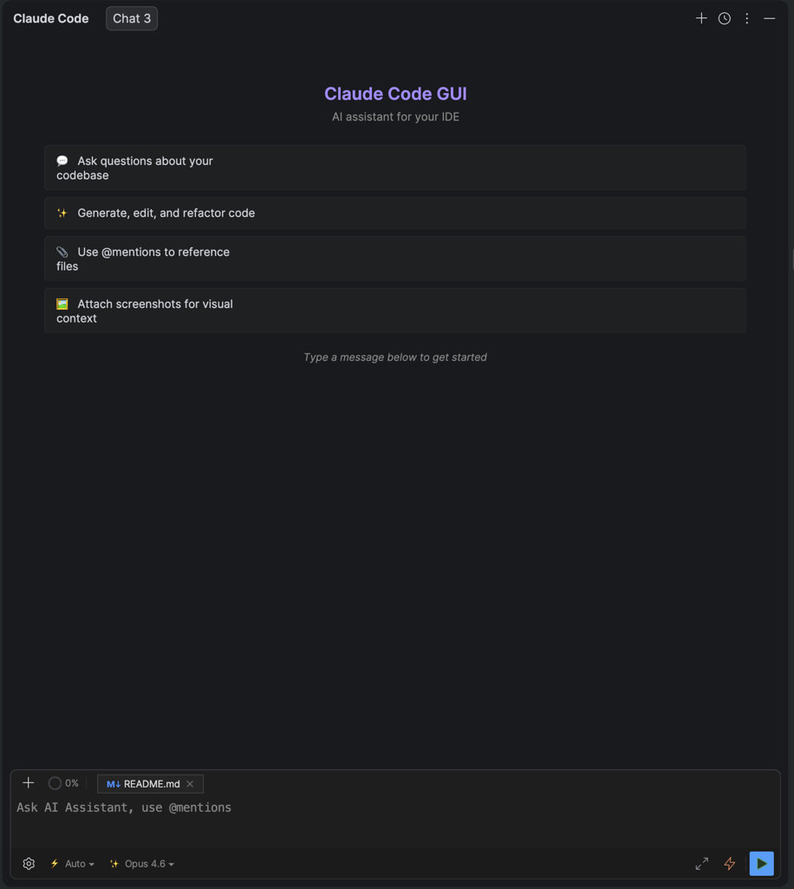

<p align="center">
  
</p>

<h1 align="center">Ultimate Claude UI</h1>

<p align="center">
  <strong>Самая быстрая и лёгкая интеграция Claude Code для IntelliJ IDEA</strong>
</p>

<p align="center">
  Kotlin + Compose/Jewel &mdash; никаких webview, никаких лагов, никаких компромиссов.
</p>

<p align="center">
  <a href="https://plugins.jetbrains.com/plugin/30343-ultimate-claude-gui"></a>
  <a href="https://plugins.jetbrains.com/plugin/30343-ultimate-claude-gui"></a>
  <a href="https://plugins.jetbrains.com/plugin/30343-ultimate-claude-gui"></a>
</p>

<p align="center">
  <a href="#установка">Установка</a> &bull;
  <a href="#возможности">Возможности</a> &bull;
  <a href="#архитектура">Архитектура</a> &bull;
  <a href="#сборка-из-исходников">Сборка</a>
</p>

<p align="center">
  <a href="README.md">🇬🇧 English</a> | <b>🇷🇺 Русский</b>
</p>

---

## Почему Ultimate Claude UI?

Большинство AI-плагинов для IDE используют встроенные браузеры (JCEF/Chromium), обёртки Electron или webview. Это значит **лишний расход памяти, долгий запуск и микро-лаги** при каждом действии.

**Ultimate Claude UI идёт другим путём.** Плагин построен на **Compose Multiplatform + Jewel** &mdash; нативном UI-тулките JetBrains для плагинов IDE. Результат:

- **Мгновенный запуск** &mdash; не нужно поднимать браузерный движок
- **Минимальный расход памяти** &mdash; никакого скрытого процесса Chromium, пожирающего RAM
- **Плавный UI** &mdash; декларативный рендеринг Compose с нативным видом IDE
- **Ощущается как встроенная функция IDE**, а не сторонняя надстройка

> *Без JCEF. Без React. Без webview. Просто быстрый нативный Compose UI, который уважает вашу IDE.*

---

## Скриншоты



---

## Возможности

### Чат и диалоги

- **Мульти-табовый чат** &mdash; несколько параллельных диалогов, переименование и закрытие вкладок
- **Стриминг ответов** с таймером в реальном времени
- **Расширенное мышление** &mdash; сворачиваемая панель для инспекции цепочки рассуждений Claude
- **История сессий** &mdash; просмотр, поиск и возобновление прошлых диалогов
- **Рендеринг Markdown** &mdash; Jewel Markdown с расширениями GFM (таблицы, зачёркивание, автоссылки, алерты)
- **Экран приветствия** с подсказками для быстрого старта

### Код и файлы

- **`@упоминания`** &mdash; ссылайтесь на любой файл проекта прямо в промпте
- **Вложения изображений** &mdash; вставляйте скриншоты (`Ctrl+V`) или перетаскивайте картинки для визуального контекста
- **Встроенный просмотр diff** &mdash; оцените предложенные изменения side-by-side перед одобрением
- **Подсветка синтаксиса** в блоках кода с автоопределением языка
- **Действие «Отправить в Claude»** (`Ctrl+Alt+K`) &mdash; выделите код в редакторе и мгновенно отправьте в чат

### Модели

| Модель | ID | Для чего |
|---|---|---|
| **Sonnet 4.6** | `claude-sonnet-4-6` | По умолчанию &mdash; быстрая и способная |
| **Opus 4.6** | `claude-opus-4-6` | Новейшая и самая мощная |
| **Opus 4.6 1M** | `claude-opus-4-6` | Длинные диалоги |
| **Haiku 4.5** | `claude-haiku-4-5` | Быстрые ответы, минимальная задержка |

Переключайте модель на лету из панели ввода.

### Режимы разрешений

| Режим | Описание |
|---|---|
| **Default** | Ручное подтверждение каждой операции (самый безопасный) |
| **Plan** | Инструменты только для чтения; генерирует план реализации для вашего одобрения |
| **Agent** | Автоматическое одобрение создания/редактирования файлов для ускорения работы |
| **Auto** | Полностью автоматический &mdash; пропускает все проверки разрешений |

### Визуализация инструментов

Каждый вызов инструмента отображается как **раскрывающаяся карточка** с индикаторами статуса:

- **Read** / **Edit** / **Write** &mdash; файловые операции с бейджами пути и количества строк
- **Bash** &mdash; превью команды и вывод
- **Search** / **Glob** &mdash; паттерны поиска и найденные файлы
- **Web Fetch** / **Web Search** &mdash; URL и отображение запроса
- **Группировка** &mdash; множественные чтения или редактирования сворачиваются в одну раскрывающуюся группу

Действия одобрения (Разрешить / Всегда разрешать / Отклонить) — **встроенные**, без модальных окон.

### Слеш-команды

Введите `/` в поле ввода для умного автодополнения:

- **Локальные**: `/clear`, `/new`, `/reset`, `/help`
- **SDK**: Полный набор команд Claude Code, загружаемых из SDK при старте
- Навигация клавишами `Вверх`/`Вниз`, `Enter` для выбора, `Esc` для закрытия

### Улучшение промптов

Нажмите `Cmd+/` (macOS) или `Ctrl+/`, чтобы **улучшить промпт** перед отправкой. Claude Haiku перепишет ваш ввод для ясности и детализации, а вы выберете между оригиналом и улучшенной версией.

### Интеграция с VCS

- **«Сгенерировать сообщение коммита с Claude»** — действие в диалоге коммита
- Анализирует ваши staged-изменения и генерирует осмысленное сообщение коммита

### Настройка темы

Три встроенных пресета (**Default**, **Dark+**, **Warm**) плюс **30+ настраиваемых цветов**:

- Пузырьки сообщений, акцентные цвета, текст, поверхности, рамки
- Цвета статусов (успех / предупреждение / ошибка)
- Стилизация блоков кода, подсветка diff
- Кнопки действий (одобрить / отклонить)

Все изменения применяются **в реальном времени** с живым превью. Отдельные палитры для светлой и тёмной тем IDE.

### Интернационализация

Полные переводы на **английский** и **русский** языки. По умолчанию следует языку IDE, или можно переопределить вручную в настройках.

---

## Архитектура

```
┌─────────────────────────────────────────────────┐
│                  IntelliJ IDEA                  │
│  ┌───────────────────────────────────────────┐  │
│  │     Ultimate Claude UI (Compose/Jewel)    │  │
│  │  ChatPanel · MessageList · ToolBlocks     │  │
│  │  ApprovalPanels · DiffViewer · Themes     │  │
│  └──────────────────┬────────────────────────┘  │
│                     │ stdin/stdout               │
│  ┌──────────────────▼────────────────────────┐  │
│  │        claude-bridge.mjs (Node.js)        │  │
│  │     оборачивает @anthropic-ai/claude-code │  │
│  └──────────────────┬────────────────────────┘  │
│                     │                            │
│  ┌──────────────────▼────────────────────────┐  │
│  │          Claude Code SDK / API            │  │
│  └───────────────────────────────────────────┘  │
└─────────────────────────────────────────────────┘
```

**Протокол коммуникации:** Построчный JSON через stdin/stdout с тегированными сообщениями (`[CONTENT_DELTA]`, `[TOOL_USE]`, `[PERMISSION_REQUEST]` и т.д.), парсинг через `SDKMessageParser` в типизированный `Flow<StreamEvent>`.

**Ключевые решения:**

- **Kotlin sealed classes** для всех алгебраических типов (`ContentBlock`, `StreamEvent`)
- **Coroutines + Flow** повсюду &mdash; никаких колбэков, никаких `CompletableFuture`
- **DynamicBundle** i18n с поддержкой переопределения языка
- **Автоопределение** Node.js и Claude CLI (Homebrew, nvm, fnm, volta, ручной PATH)

---

## Установка

### Из JetBrains Marketplace

> *Скоро*

### Из исходников

```bash
git clone https://github.com/dsudomoin/ultimate-claude-gui.git
cd ultimate-claude-gui
./gradlew buildPlugin
```

ZIP плагина появится в `build/distributions/`. Установите его через **Settings > Plugins > шестерёнка > Install Plugin from Disk**.

### Требования

- **IntelliJ IDEA** 2025.3.3+
- **Node.js** 18+ (автоопределение или настройка в параметрах)
- **Claude CLI** (команда `claude login` должна быть выполнена хотя бы раз)

---

## Сборка из исходников

```bash
./gradlew runIde          # Запуск песочницы IDE с плагином
./gradlew build           # Полная сборка (компиляция + упаковка)
./gradlew buildPlugin     # Сборка дистрибутива ZIP
./gradlew test            # Запуск тестов
```

---

## Структура проекта

```
src/main/kotlin/ru/dsudomoin/claudecodegui/
├── ui/
│   ├── compose/
│   │   ├── chat/        # Сообщения, пузырьки, блоки инструментов, панель мышления
│   │   ├── input/       # Ввод чата, слеш-команды, выбор модели
│   │   ├── approval/    # Встроенные панели разрешений (Compose)
│   │   ├── dialog/      # План, улучшение промпта, вопросы
│   │   ├── status/      # Задачи, изменения файлов, вкладки субагентов
│   │   ├── history/     # Браузер истории сессий
│   │   ├── common/      # ComposePanelHost, markdown, бейджи
│   │   ├── theme/       # Мост тем Compose, расширения цветов
│   │   └── toolwindow/  # ComposeChatContainer, фабрика панелей
│   ├── theme/           # Система цветов, пресеты, ThemeManager
│   ├── diff/            # Интерактивный просмотр diff
│   └── toolwindow/      # Фабрика окна инструментов
├── core/
│   ├── model/           # Message, ContentBlock, StreamEvent
│   └── session/         # Хранилище сессий
├── provider/claude/     # ClaudeProvider (жизненный цикл bridge)
├── bridge/              # BridgeManager, SDKMessageParser
├── service/             # Настройки, OAuth, улучшение промптов
├── settings/            # UI настроек
├── action/              # Действия IDE (отправка выделения, сообщение коммита)
└── command/             # Реестр слеш-команд
```

---

## Технологический стек

| Компонент | Технология |
|---|---|
| Язык | Kotlin 2.3.10, JVM 21 |
| Платформа | IntelliJ Platform SDK 2025.3.3 |
| UI | Compose Multiplatform + Jewel |
| Markdown | Jewel Markdown (GFM таблицы, алерты, зачёркивание, автоссылки) |
| Асинхронность | kotlinx-coroutines + Flow |
| Сериализация | kotlinx-serialization |
| Bridge | Node.js + `@anthropic-ai/claude-code` SDK |
| Сборка | Gradle + IntelliJ Platform Plugin 2.11.0 |

---

## Лицензия

MIT

---

<p align="center">
  <sub>Собрано на Compose/Jewel. Потому что ваша IDE заслуживает лучшего, чем webview.</sub>
</p>